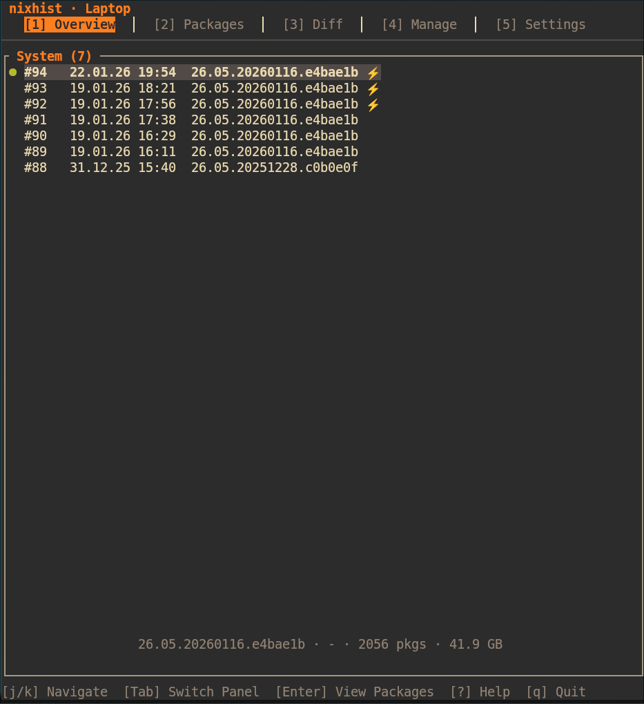
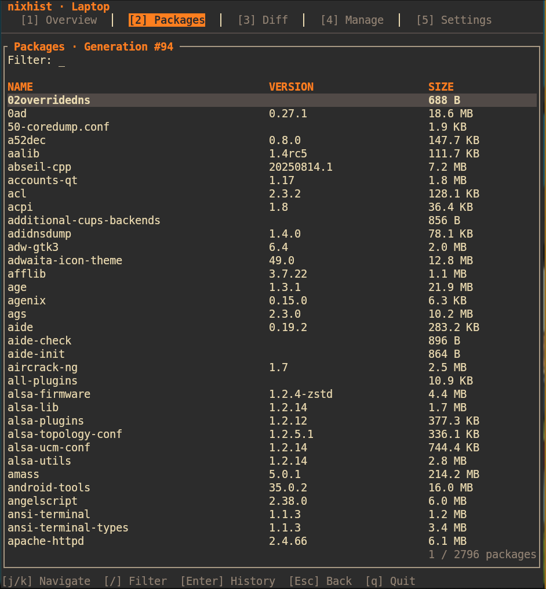
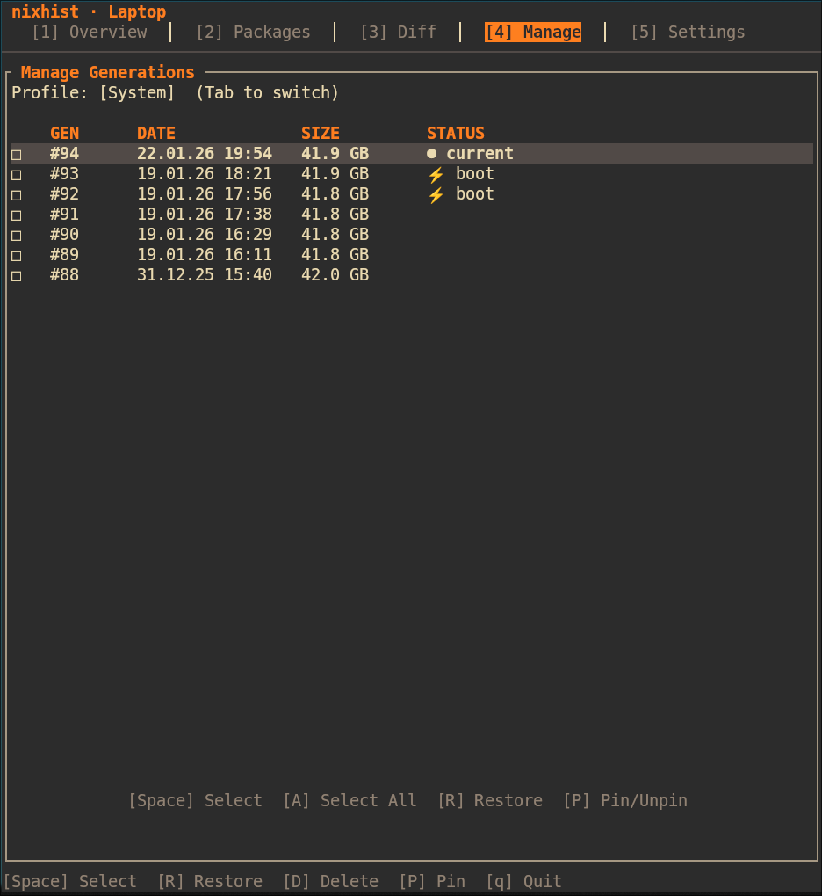

# nixhist

<div align="center">


**A beautiful TUI for viewing, comparing, and managing NixOS generations**

Built with ❤️ for the NixOS community

[Features](#features) • [Installation](#installation) • [Usage](#usage) • [Configuration](#configuration)

</div>

---

## 🎨 Screenshots

<table>
  <tr>
    <td><br/><sub><b>Overview</b> - System and Home-Manager generations</sub></td>
    <td><br/><sub><b>Packages</b> - Browse and filter packages</sub></td>
  </tr>
  <tr>
    <td><br/><sub><b>Diff</b> - Compare generations side-by-side</sub></td>
    <td><br/><sub><b>Manage</b> - Restore, delete, or pin generations</sub></td>
  </tr>
</table>

## ✨ Features

- **5 Tabs** — Overview, Packages, Diff, Manage, Settings
- **Smart Diff** — Compare any two generations with detailed package analysis
- **Safe Operations** — Confirmation dialogs, 10s undo timer, pin protection
- **3 Built-in Themes** — Gruvbox, Nord, Transparent (or create your own!)
- **Dual Support** — Works with System and Home-Manager generations
- **Flexible Setup** — Flakes and traditional Channels both supported
- **Responsive Layout** — Adapts to terminal width automatically

### Legend
- `●` Current generation
- `★` Pinned generation
- `⚡` In bootloader

## 📦 Installation

### Build from Source

**Requirements:** Rust toolchain (install via [rustup](https://rustup.rs/))

```bash
# Clone the repository
git clone https://github.com/daskladas/nixhist
cd nixhist

# Build with Cargo
cargo build --release

# Run it
./target/release/nixhist
```

> **Note:** Make sure you have `cargo` installed. If not, install it with:
> ```bash
> curl --proto '=https' --tlsv1.2 -sSf https://sh.rustup.rs | sh
> ```

### Optional: Install to PATH

```bash
# Copy to ~/.local/bin (make sure it's in your PATH)
cp target/release/nixhist ~/.local/bin/

# Or system-wide (requires sudo)
sudo cp target/release/nixhist /usr/local/bin/
```

> **Coming Soon:** Official nixpkgs package! 🚀

## 🚀 Usage

```bash
nixhist              # Normal mode
nixhist --dry-run    # Preview mode (no changes made)
nixhist --help       # Show all options
```

### Keybindings

#### Global
| Key | Action |
|-----|--------|
| `1-5` | Switch tabs |
| `j` / `k` | Navigate down / up |
| `g` / `G` | Jump to top / bottom |
| `Tab` | Switch panel / list |
| `q` | Quit |

#### Tab-Specific
| Tab | Key | Action |
|-----|-----|--------|
| **Overview** | `Enter` | View packages in generation |
| **Packages** | `/` | Filter packages |
| **Packages** | `Esc` | Clear filter |
| **Diff** | `Enter` | Select generation |
| **Diff** | `c` | Clear selections |
| **Manage** | `Space` | Toggle selection |
| **Manage** | `R` | Restore generation |
| **Manage** | `D` | Delete generation(s) |
| **Manage** | `P` | Pin / unpin generation |
| **Settings** | `Enter` | Change setting |

## ⚙️ Configuration

Configuration is stored in `~/.config/nixhist/config.toml`

### Basic Settings

```toml
theme = "gruvbox"      # gruvbox | nord | transparent
layout = "auto"        # auto | sidebyside | tabsonly

[display]
show_nixos_version = true
show_kernel_version = true
show_package_count = true
show_size = true
show_boot_entry = true

[pinned]
system = [140, 130]
home_manager = [85, 70]
```

### 🎨 Want to Rice It?

Not feeling the default themes? **Create your own!**

The theme system is designed to be easily customizable. Edit `src/ui/theme.rs` to add your own color scheme:

```rust
pub fn my_custom_theme() -> Self {
    Self {
        bg: Color::Rgb(30, 30, 30),           // Your background
        fg: Color::Rgb(200, 200, 200),        // Your foreground
        accent: Color::Rgb(255, 100, 100),    // Your accent color
        // ... customize all colors
        is_transparent: false,
    }
}
```

Then add it to the `ThemeName` enum in `src/config.rs`:

```rust
pub enum ThemeName {
    Gruvbox,
    Nord,
    Transparent,
    MyCustomTheme,  // Add your theme here
}
```

> **🎁 Share Your Theme!**  
> Created an awesome theme? I'd love to see it! Feel free to open an issue or PR with your theme.  
> I'm happy to include community themes in nixhist so everyone can enjoy them (with full credit to you, of course! ⭐)

Rebuild and enjoy your personalized nixhist! 🎉

## 🛡️ Safety Features

| Feature | Description |
|---------|-------------|
| **10-Second Undo** | Cancel deletions within 10 seconds |
| **Pin Protection** | Pinned generations cannot be deleted |
| **Current Protection** | Active generation is always protected |
| **Confirmation Dialogs** | Review commands before execution |
| **Dry-Run Mode** | Test operations without making changes |

## 🗺️ Roadmap

### ✅ v1.0.0 (Current)
- Full generation management (view, restore, delete, pin)
- Package browsing with filtering
- Generation comparison with detailed diff
- Three built-in themes
- Responsive layout

### 🚧 v1.1.0 (Planned)
- Quick-delete: "Delete all older than X days"
- Quick-delete: "Keep last N generations"
- Package history tracking
- Export package lists

### 🔮 v1.2.0 (Future)
- Garbage collection integration
- Disk space analysis per generation
- Custom keybinding configuration

### 💭 v2.0.0 (Ideas)
- Multi-machine support
- Rollback scheduling
- nixos-rebuild integration

## 🐛 Troubleshooting

<details>
<summary><b>"Permission denied" when restoring/deleting</b></summary>

System operations require `sudo`. nixhist will prompt for your password automatically.
</details>

<details>
<summary><b>Home-Manager not detected</b></summary>

Check if Home-Manager is installed and one of these paths exists:
- `~/.local/state/home-manager/profiles/` (standalone)
- `/nix/var/nix/profiles/per-user/$USER/home-manager` (module)
</details>

<details>
<summary><b>Generations not loading</b></summary>

Ensure:
1. `nix-env` is in your PATH
2. You have read access to `/nix/var/nix/profiles/`
</details>

## 🤝 Contributing

Contributions, bug reports, and feature suggestions are very welcome! Feel free to open an issue or pull request.

## 📝 License

MIT License - see [LICENSE](LICENSE) for details.

## 🙏 Acknowledgments

- Built with [ratatui](https://github.com/ratatui-org/ratatui) — the amazing Rust TUI library
- Inspired by [lazygit](https://github.com/jesseduffield/lazygit) and [btop](https://github.com/aristocratos/btop)
- Made possible by the incredible [NixOS](https://nixos.org/) community

---

<div align="center">

### 💝 Made with Love

This project is developed in my free time as a contribution to the NixOS community.  
I maintain and improve it whenever I can, always striving to make it better.

If you find nixhist useful, consider:
- ⭐ Starring the repo
- 🐛 Reporting bugs
- 💡 Suggesting features
- 🤝 Contributing code

**Thank you for using nixhist!** 🎉

</div>